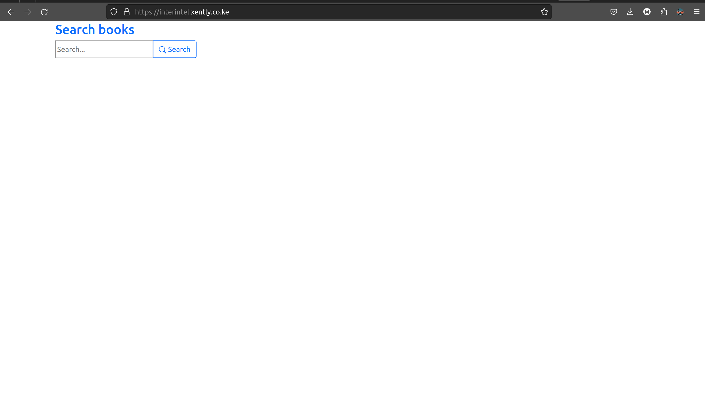
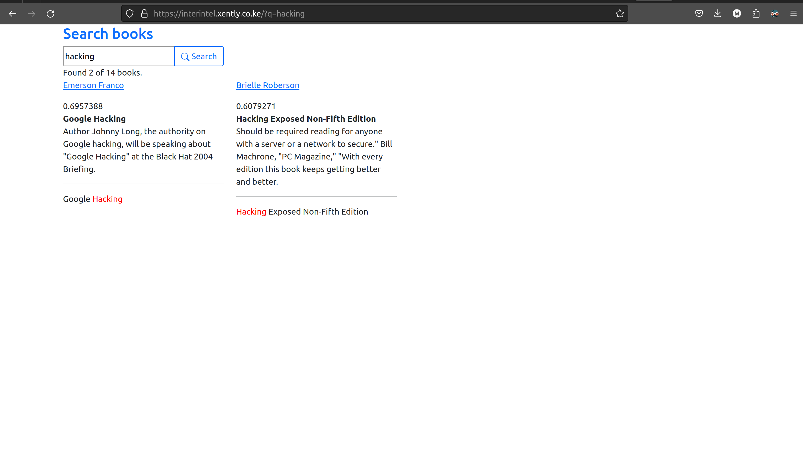
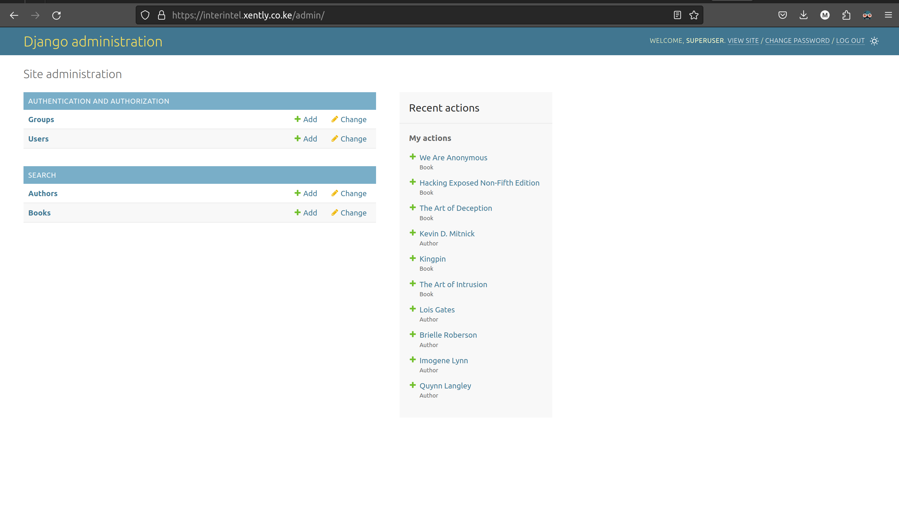

# Search

## Question 1

> Give examples of different integration protocols you have come across and give example scripts in python 3 on how to
> achieve each one.

### REST API

REST (Representational State Transfer) is a set of architectural principles for designing networked applications.
It is a widely used protocol for integrating with external systems and services.

**Example script in Python 3 to make a REST API call using the [requests](https://pypi.org/project/requests/) library:**

```python
import requests

url = 'https://httpbin.org/basic-auth/user/pass'
response = requests.get(url, auth=('user', 'pass'))

if response.status_code == 200:
    data = response.json()
    print(data)
else:
    print("Error:", response.status_code)
```

### AMQP (Advanced Message Queuing Protocol)

AMQP is a messaging protocol that supports reliable and asynchronous messaging between applications.

**Example script in Python 3 to publish and consume messages using the [pika](https://pypi.org/project/pika/) library:**

```python
import pika

connection = pika.BlockingConnection(pika.ConnectionParameters(host="localhost"))
channel = connection.channel()

channel.queue_declare(queue="my-queue", durable=True)


def callback(ch, method, prop, body):
    print("Received message:", body.decode("utf-8"))
    ch.basic_ack(delivery_tag=method.delivery_tag)


channel.basic_consume(queue="my-queue", on_message=callback)
channel.start_consuming()
```

## Question 2

> Give a walkthrough of how you will manage a data streaming application sending one million notifications every hour
> while giving examples of technologies and configurations you will use to manage load and asynchronous services

Managing a data streaming application that sends one million notifications per hour requires a robust and scalable
infrastructure to handle the high volume of messages and ensure reliable delivery.
Here's a walkthrough of the approach:

1. **Data Ingestion:**

    - Implement a scalable data pipeline to ingest the data from its source.
      Utilize message queues like Apache Kafka to buffer and handle spikes in data volume.

2. **Data Processing and Notification Generation:**

    - Employ a distributed processing framework like Apache Spark to process the ingested data in parallel, enabling
      efficient notification generation.
    - Utilize task parallelism and partitioning to distribute the workload across multiple machines, ensuring high
      throughput.

3. **Notification Delivery:**

    - Implement a reliable notification delivery mechanism using push notifications or asynchronous messaging services
      like Google/Firebase Cloud Messaging.
    - Employ batching strategies to send notifications in batches, reducing the overhead of individual message delivery.

4. **Monitoring and Alerting:**

    - Establish comprehensive monitoring and alerting systems to track key performance indicators (KPIs) such as message
      latency, delivery rates, and error rates.
    - Utilize tools like Grafana or Prometheus to visualise metrics and set up alerts to proactively identify and
      address potential issues.

5. **Autoscaling and Fault Tolerance:**

    - Implement autoscaling mechanisms to dynamically adjust the number of processing units based on real-time demand.
    - Utilize cloud-based infrastructure and services for automatic resource provisioning and fault tolerance.

6. **Asynchronous Services and Microservices Architecture:**

    - Employ an asynchronous microservices architecture to decouple the components of the data streaming application.
    - Utilize asynchronous messaging patterns to exchange messages between microservices, ensuring loose coupling and
      scalability.

Example Technologies and Configurations:

- **Data Ingestion:**
    - Apache Kafka: Set up multiple Kafka brokers to handle the high volume of messages.
      Configure partitions and replication to ensure fault tolerance and scalability.

- **Data Processing and Notification Generation:**
    - Apache Spark: Configure Spark Streaming to process data streams in real-time.
      Utilize Spark SQL for data transformations and notification generation.

- **Notification Delivery:**
    - Google/Firebase Cloud Messaging (G/FCM): Utilize FCM to send push notifications to mobile devices or applications.
      Configure topic subscriptions and notification delivery policies.

- **Monitoring and Alerting:**
    - Grafana: Set up Grafana dashboards to visualize metrics from Kafka, Spark, and notification delivery services.
    - Prometheus: Utilize Prometheus to collect and expose metrics from various components of the data streaming
      application.

- **Autoscaling and Fault Tolerance:**
    - Kubernetes: Implement Kubernetes to manage the deployment and scaling of microservices.
      Utilize autoscaling rules to adjust container replicas based on resource utilisation.

## Question 3

> Give examples of different encryption/hashing methods you have come across (one way and two way) and give example
> scripts in python 3 on how to achieve each one.

### One-way Encryption

One-way encryption is a type of encryption where data can be encrypted but not decrypted.
This is often used to protect passwords and other sensitive information.

#### Examples of one-way encryption methods

* **MD5** (Message Digest 5): MD5 is an older hashing algorithm that is no longer considered secure.
  However, it is still widely used for legacy applications.
* **SHA-256** (Secure Hash Algorithm 2, 256 bits): SHA-256 is a more secure hashing algorithm than MD5.
  It is commonly used to hash passwords and other sensitive information.

**Example script in Python 3 for one-way encryption using SHA-256:**

```python
import hashlib


def hash_content(content):
    hasher = hashlib.sha256()
    hasher.update(content.encode('utf-8'))
    return hasher.hexdigest()


password = "mypassword"
hashed_password = hash_content(password)
print(hashed_password)
```

### Two-way Encryption

Two-way encryption is a type of encryption where data can be both encrypted and decrypted.
This is often used to protect sensitive data that needs to be stored and transmitted securely.

#### Examples of two-way encryption methods

* **AES (Advanced Encryption Standard)**: AES is a symmetric encryption algorithm that is considered to be very secure.
  It is commonly used to encrypt data that needs to be stored on disk or transmitted over a network.
* **RSA (Rivest-Shamir-Adleman)**: RSA is an asymmetric encryption algorithm that is commonly used to secure digital
  communications.

**Example script in Python 3 for two-way encryption using AES, based
on [pycryptodome](https://pypi.org/project/pycryptodome/) library:**

```python
from Crypto.Cipher import AES
from Crypto.Random import get_random_bytes


def encrypt(key, plaintext):
    cipher = AES.new(key, AES.MODE_EAX)
    ciphertext, tag = cipher.encrypt_and_digest(plaintext.encode("utf-8"))

    with open("encrypted.bin", "wb") as file_out:
        for x in (cipher.nonce, tag, ciphertext):
            file_out.write(x)
    return file_out.name


def decrypt(key, encrypted_data_file):
    with open(encrypted_data_file, "rb") as file_in:
        nonce, tag, ciphertext = [file_in.read(x) for x in (16, 16, -1)]

        # let's assume that the key is somehow available again
        cipher = AES.new(key, AES.MODE_EAX, nonce)
        data = cipher.decrypt_and_verify(ciphertext, tag)
    return data.decode('utf-8')


key = get_random_bytes(16)
plaintext = "This is a secret message."
encrypted_data_file = encrypt(key, plaintext)
decrypted_plaintext = decrypt(key, encrypted_data_file)
print(decrypted_plaintext)
```

## Question 5

> Create a search and results page using Django and postgreSQL database.
> The Django application should be deployed on uwsgi/nginx webserver and NOT the development server.
> This should also be deployed on a red-hat based Linux environment or an alpine docker image container.

**URL**: https://interintel.xently.co.ke



### Admin page

#### Credentials

**Username**: superuser
**Password**: demoproject



### Implementation

The implementation of the search and results page, I
used [Django ORM](https://docs.djangoproject.com/en/4.2/ref/contrib/postgres/search/) implementation of
PostgreSQL [full text search engine](https://www.postgresql.org/docs/current/textsearch.html).

### Deployment

The deployment was done automatically using:

1. **[DigitalOcean](https://www.digitalocean.com/)**: Cloud service provider.
2. **[Terraform](https://www.terraform.io/)**: For infrastructure provisioning and configuration.
3. **[Docker hub](https://www.docker.com/)**: For hosting the publicly accessible docker
   image ([ajharry69/interintel](https://hub.docker.com/r/ajharry69/interintel/tags)) of the product.

#### Steps

From the repositories rood directory.

##### Docker image

To build and publish docker image of the product, there are shorthand [make](https://www.gnu.org/software/make/)
commands documented as follows:

1. **Build docker image**: `make -f deploy/Makefile build_image tag="v1.1.1"`
2. **Build push docker image**: `make -f deploy/Makefile push_image tag="v1.1.1"`
3. **Build and push docker image**: `make -f deploy/Makefile build_and_push_image tag="v1.1.1"`

##### Infrastructure provisioning and configuration

1. **Initialize terraform**: `terraform -chdir=./deploy/ init`.
2. **Provision and configure infrastructure**: `terraform -chdir=./deploy/ apply -auto-approve`.
